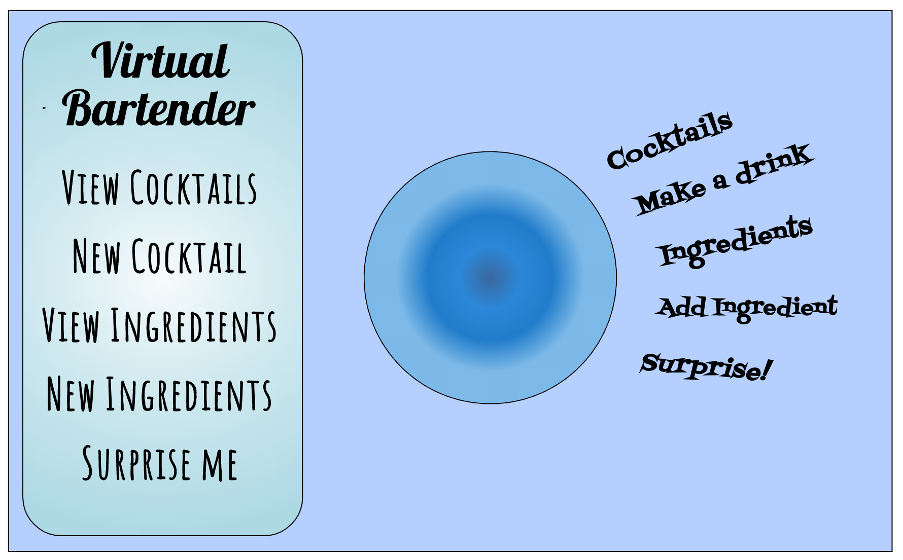

# VIRTUAL BARTENDER
---
## Access 
https://jay-project2.herokuapp.com/

---
## Technologies and Resources used

- CSS, HTML and JavaScript
- Node.js, Express, Mongoose, EJS and MongoDB
- Sketch.io for wireframe
- Visual Studio Code
- [CodePen.io](https://www.codepen.io)
- [The Cocktail Database](https://www.thecocktaildb.com/api.php)

---
## User Stories
- As a user, I want to view the collection of drinks, so that I can view all the drinks that are available.
- As a user, I want to add a drink, so that I can contribute to the collectioe, share and store my recipe. 
- As a user, I want to be able to add ingredients to a drink, so that I can know which ingredients are needed to make each drink.
- As a user, I want to view all of the ingredients that are available, so I can see if I need to add my ingredients.
- As a user, I want to add more ingredients, so that I can use them in the drink recipes I plan on adding.
- As a user, I want to edit the title of added drinks, so that I can fix any mistakes.
- As a user, I want to update the instructions for drinks, so that I can add or remove instructions. 
- As a user, I want to remove a drink, so that I can remove drinks that I do not want to be in the collection.
- As a user, I want to be able to view a picture of the drink, so that I can get an idea of how the drink should look.
- As a user, I want to be suggested a drink, so that if I can't think of one to make I will have a suggestion.

---
## Approach taken, Planning, Notes and Wireframe

- Started out by planning and making a wireframe
 
- Began with getting the 7 RESTful routes working and full CRUD 
- Used the Model, Views, Controllers structure (MVC)
- KISS (Keep It Simple Stupid) and DRY (Don't Repeat Yourself) principles
